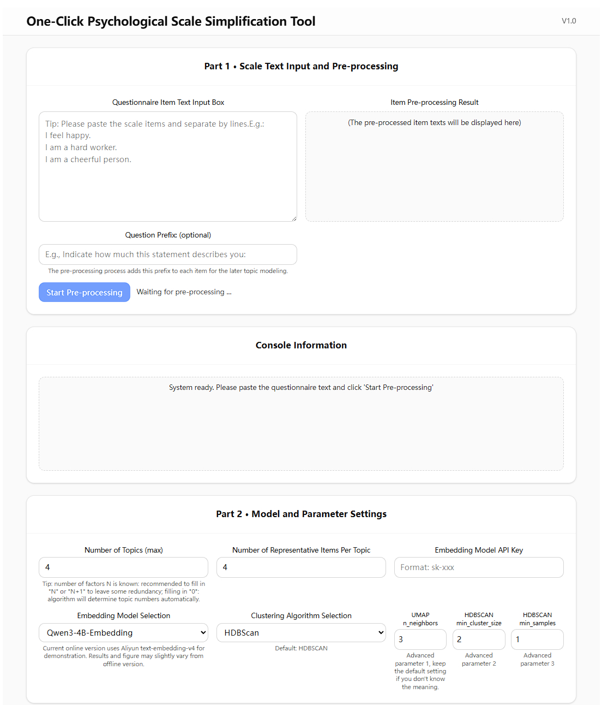
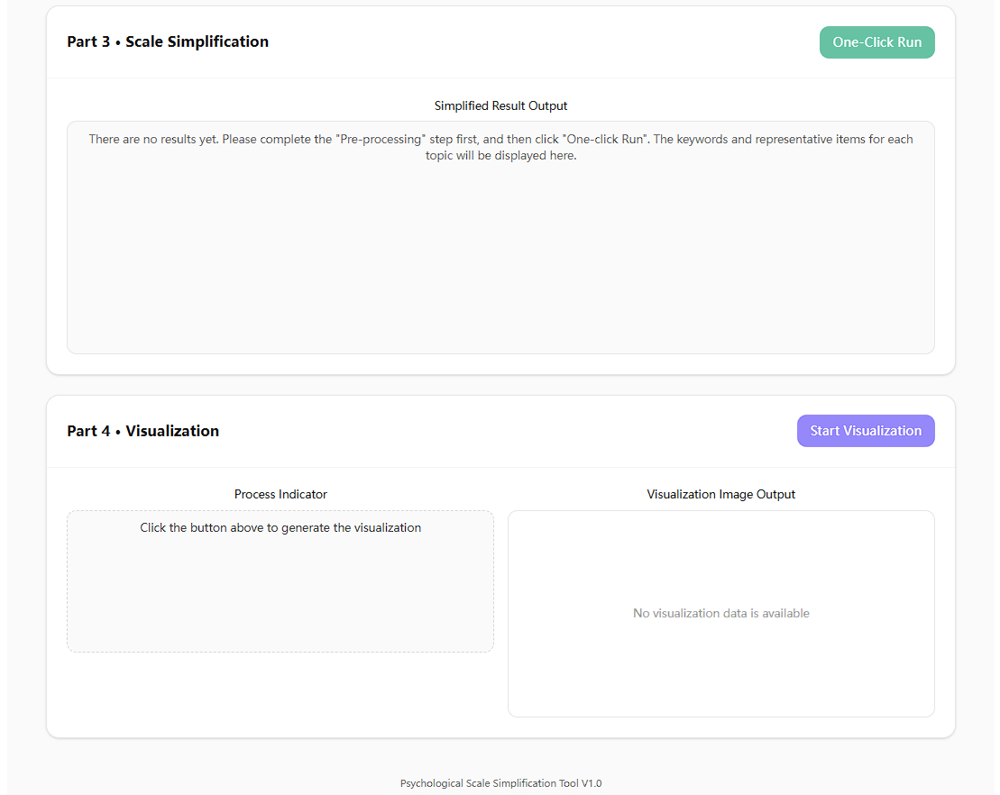
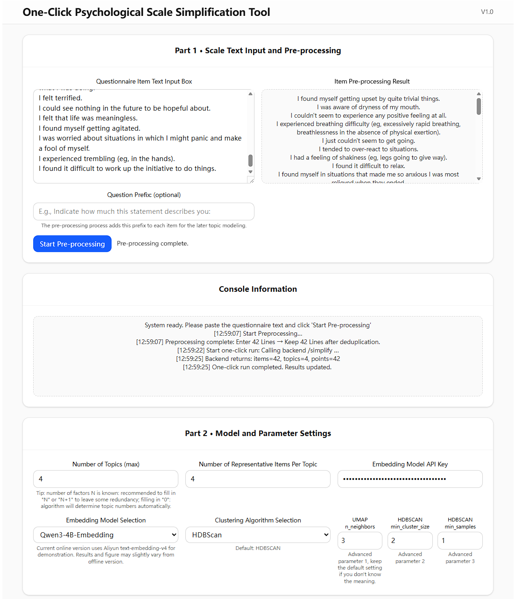
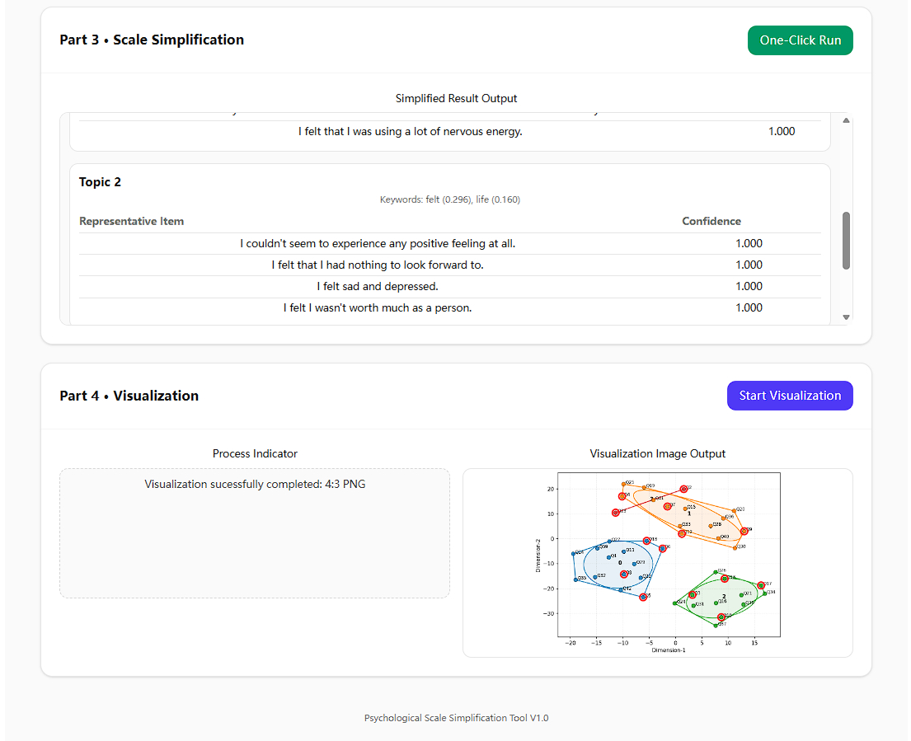

# Response-Free Semantic Scale Simplification

This repository contains the official implementation of:

_"Discovering Semantic Latent Structures in Psychological Scales: A Response-Free Pathway to Efficient Simplification"_

This project provides **two versions** of the tool:

1. **Scale-Simp WebApp** — a lightweight browser-based interactive version
2. **Scale-Simp Code** — a python jupyter notebook-based code version for advanced users

Both versions implement the same core idea:  
Given questionnaire item texts, the framework performs semantic encoding, clustering, topic modeling, and representative-item selection, and then returns a simplified short form together with topic summaries and visualization.

> **Note.** The current **_WebApp_** release is the online demo version of the system. To keep deployment lightweight, the default text encoder uses the *Qwen3 embedding API* instead of the local *[Qwen3-Embedding-4B](https://huggingface.co/Qwen/Qwen3-Embedding-4B)* model. The **_Code_** release is the pure local-model version, which corresponds to the paper's setup. So their simplification results may differ.

---

## Interface Preview

#### Idle



#### Working



---

## Workflow and Features

### Scale-Simp WebApp
- User inputs questionnaire items directly in the browser
- Optionally add a shared item prefix before analysis
- Framework performs semantic clustering and topic-based simplification without additional respondent data
- Outputs representative items for each discovered topic
- Visualizes the semantic structure of the questionnaire in 2D figure

### Scale-Simp Code
- Provides the same core simplification and visualization logic in pure code form
- Includes a beginner-friendly jupyter notebook example
- Suitable for advanced researchers who want to inspect, modify, debug, or extend the workflow directly

---

## Project Structure

```text
sem-scale/
├─ README.md
├─ figures/
├─ examples/
│  └─ dass_scale_items.txt
├─ scale-simp-webapp/
│  ├─ backend/                  # FastAPI backend (main service code in backend/main.py)
│  ├─ public/
│  ├─ src/                      # Frontend source code (main UI code in src/)
│  ├─ .gitignore
│  ├─ eslint.config.js
│  ├─ index.html
│  ├─ package.json
│  ├─ package-lock.json
│  ├─ postcss.config.js
│  ├─ tailwind.config.js
│  ├─ tsconfig.app.json
│  ├─ tsconfig.json
│  ├─ tsconfig.node.json
│  ├─ vite.config.ts
│  ├─ requirements.txt
│  └─ ...
└─ scale-simp-code/
   ├─ simp-code-dass-example.ipynb
   └─ requirements.txt
```

For clarity, this README highlights only the most important folders and entry files. Additional files inside `backend/` and `src/` are omitted here, as they are internal implementation details and are not required for basic installation or usage.

---

## Requirements

### 1. API Key of the Qwen Embedding Model

The current WebApp demo version uses the **Qwen online embedding API** by default. Please register for an Alibaba Cloud account and obtain an API key:

`https://www.alibabacloud.com/help/en/model-studio/apikey`

The API key can be entered directly in the web interface when the app is running.
The default embedding model in the WebApp has been specified as **`text-embedding-v4`**, which is relatively inexpensive (approximately less than **$0.07 / 1M tokens** at the time of writing).
Source: `https://www.alibabacloud.com/help/en/model-studio/model-pricing`

### 2. Backend / Code Environment

Recommended:

* **Anaconda or Miniconda** (strongly recommended)
* Python 3.12 or 3.11

We recommend using Anaconda/Miniconda because it allows users to create an isolated environment quickly and avoids many low-level dependency issues that may occur when installing scientific Python libraries manually.

Download links:

* Anaconda: `https://www.anaconda.com/download`
* Miniconda: `https://www.anaconda.com/docs/getting-started/miniconda/install`

### 3. Frontend Environment (WebApp only)

Recommended:

* **Node.js LTS version**
* npm

The Node.js installer from the official website already includes **npm** in most standard installations.

Download link:

* Node.js: `https://nodejs.org/en/download`

Using the official **LTS installer** from the Node.js website is recommended for compatibility and stability.

---

## Installation

Before starting, please open a command-line terminal:

* **Windows**: Command Prompt, PowerShell, or Anaconda Prompt
* **macOS / Linux**: Terminal

### Step 1. Obtain the project files

You can either:

1. **Clone the repository** via Git
2. **Download the project as a ZIP file** from GitHub and extract it manually

If using Git:

```bash
git clone https://github.com/bowang-rw-02/sem-scale
cd sem-scale
```


If using the ZIP download method, extract the folder and then navigate to the project root directory (`sem-scale`) in your terminal before continuing.

---

## Running the WebApp Version

You need **two terminals**: one for the backend and one for the frontend.

### Step 1. Create the Python environment

```bash
conda create -n sem-simp python=3.12 -y
conda activate sem-simp
```

### Step 2. Install backend dependencies

```bash
cd scale-simp-webapp
pip install -r requirements.txt
```

### Step 3. Install frontend dependencies

Since the frontend is located inside `scale-simp-webapp`, run:

```bash
npm install
```

### Step 4. Start the backend

Open the first terminal, activate the environment, and run:

```bash
cd sem-scale/scale-simp-webapp
conda activate sem-simp
uvicorn backend.main:app --reload --port 8000
```

If the backend starts successfully, the API docs will be available at:

`http://127.0.0.1:8000/docs`

### Step 5. Start the frontend

Open a second terminal and run:

```bash
cd sem-scale/scale-simp-webapp
npm run dev
```

Vite will start the frontend development server and display a local URL, typically:

`http://localhost:5173/`

### Step 6. Open the app in your browser

Visit:

`http://localhost:5173/`

---

## Running the Code Version

The pure-code version is intended for advanced users who prefer direct scripting and notebook-based experimentation.

> **Important.** The notebook-based code version uses the local **Qwen3-Embedding-4B** model rather than the online API.  
> Users therefore need to download the model weights in advance (approximately **8 GB**, depending on the format).  
> Running this version also requires substantially more local resources than the WebApp version. In practice, we recommend preparing around **16 GB** of available GPU memory or system memory for smooth execution.  
> If sufficient GPU memory is not available, CPU-only execution may still be possible, but it will be significantly slower.

### Step 1. Create the Python environment

```bash
conda create -n sem-simp python=3.12 -y
conda activate sem-simp
```

### Step 2. Install dependencies

```bash
cd sem-scale/scale-simp-code
pip install -r requirements.txt
```

### Step 3. Run the notebook

Open:

```text
simp-code-dass-example.ipynb
```

This notebook provides a beginner-friendly example of:

* loading questionnaire item texts,
* running simplification,
* and generating visualization outputs.

---

## How to Use 

### How to use the WebApp

> For a quick test, users may start with the provided DASS example file.

1. Paste questionnaire items into the **Part 1 - Item Text Input** box, one item per line.
2. Optionally enter an **Item Prefix** if your questionnaire uses a shared instruction (for example: *"Indicate how much this statement describes you:"*).
3. Click **Start Pre-processing**.
4. Enter your API key in **Part 2 - Embedding Model API Key**.
5. Adjust model settings such as:

   * number of topics
   * number of selected (representative) items per topic
   * embedding models and clustering algorithms
     (currently only Qwen and HDBSCAN are implemented in the demo version)
   * UMAP and HDBSCAN advanced parameters
6. Click **Part 3 - One-Click Run** to generate:

   * topic summaries
   * representative items
   * simplified short-form results
7. Click **Part 4 - Start Visualization** to generate a 2D semantic plot.

### How to use the Code

The DASS example are already loaded in the notebook, so users only need to click each cell sequentially.

---

## Troubleshooting

### The webpage opens, but clicking "Run" shows `Failed to fetch`

This usually means the backend is not running.

Please check:

1. Whether the backend terminal is active
2. Whether `http://127.0.0.1:8000/docs` can be opened in a browser
3. Whether the frontend and backend are both running from the correct project directory

### The visualization image is broken

Please make sure the backend `/plot2d` endpoint is running correctly and that the frontend is receiving a valid base64 PNG string.

### `npm run dev` fails

Make sure frontend dependencies were installed successfully:

```bash
npm install
```

### `uvicorn backend.main:app --reload --port 8000` fails

Make sure:

* you are in the `scale-simp-webapp` directory
* the `sem-simp` environment is activated
* backend dependencies were installed via `pip install -r requirements.txt`

### The notebook version does not run

Make sure:

* the correct conda environment is activated
* dependencies in `scale-simp-code/requirements.txt` are installed
* the notebook is opened from the correct folder

---

## Citation

If you find our paper or this tool useful in your academic work, please consider citing the corresponding paper.

```text
[paper information]
```

---

## License

This project is licensed under the Apache License 2.0.
See the `LICENSE` file for details.

---

## Example Dataset

An example item file based on the DASS scale is provided for quick testing:

* `examples/dass_scale_items.txt`

Users can paste these items directly into the web interface to try the simplification workflow.

For the code version, the provided notebook `simp-code-dass-example.ipynb` also demonstrates a DASS-based example workflow.

---

## References

The example dataset included in this repository is based on the DASS scale. Please refer to the original publication and dataset source for details.

* Lovibond, S. H. (1995). *Manual for the Depression Anxiety Stress Scales*. Sydney Psychology Foundation.
* OpenPsychometrics.org. (2019). *Depression Anxiety Stress Scales (DASS) raw data* [Publicly available dataset].
  `https://openpsychometrics.org/_rawdata/DASS_data_21.02.19.zip`

---

## Acknowledgements

This project builds on modern NLP and topic-modeling libraries, including FastAPI, UMAP, HDBSCAN, BERTopic, Vite, and Tailwind CSS.
